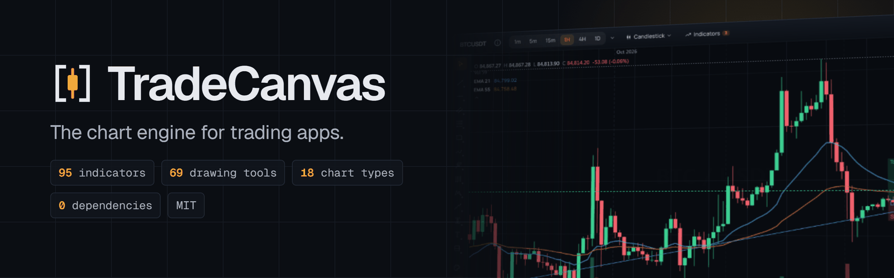
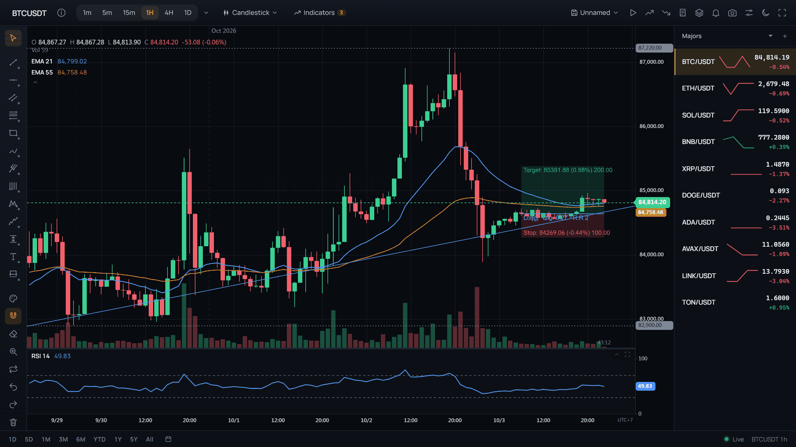
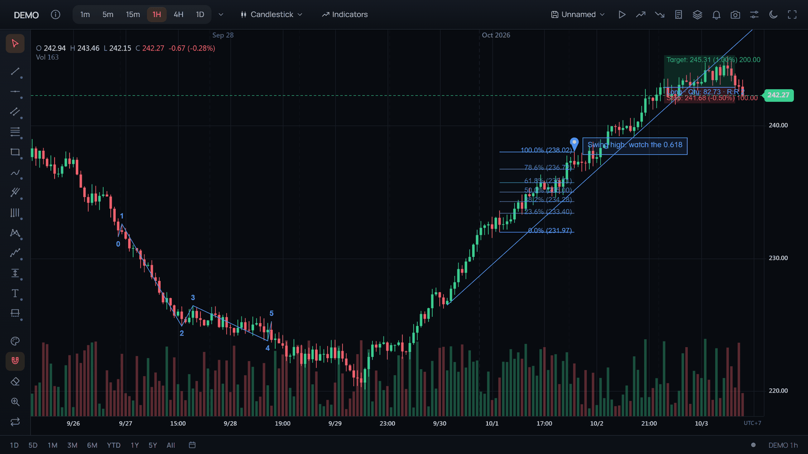
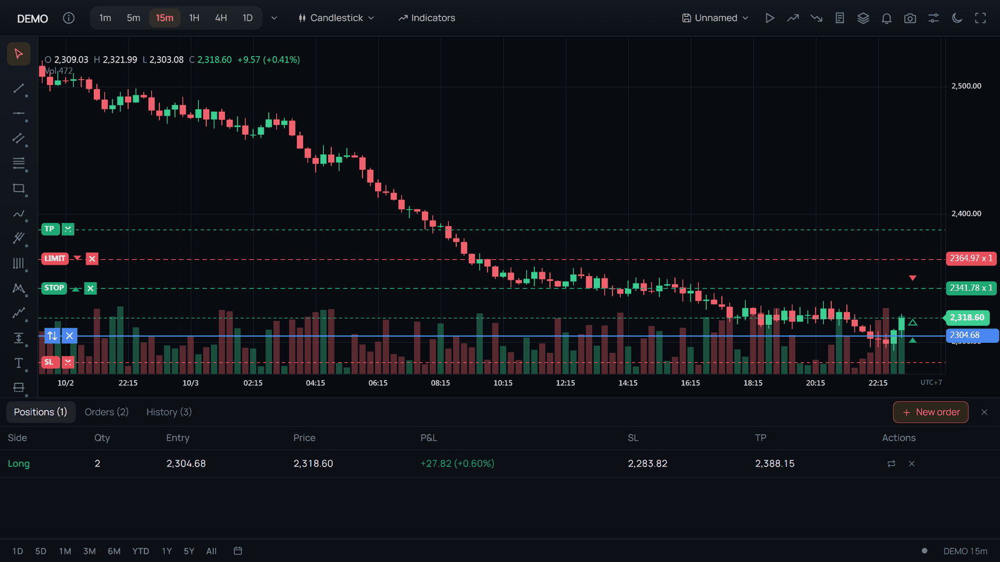
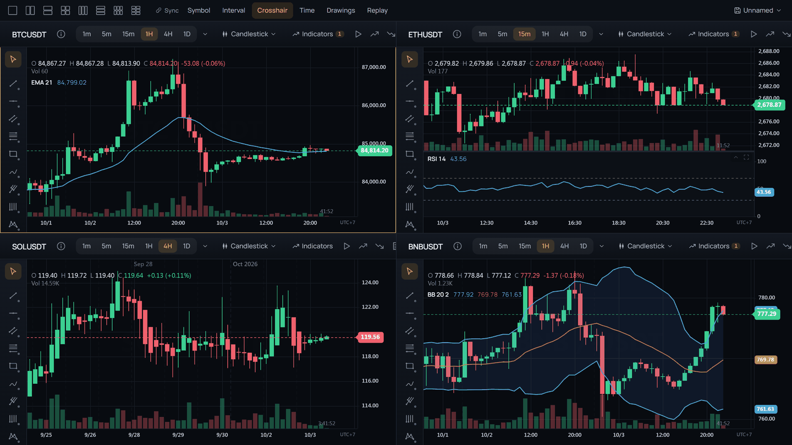
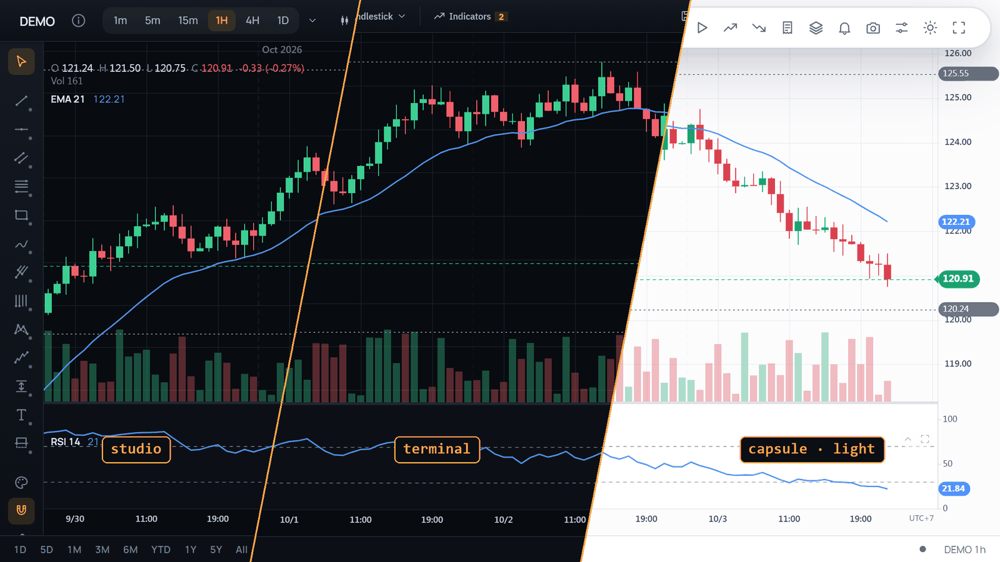

<p align="center">
  <a href="https://bonguynvan.github.io/tradecanvas/ja/"></a>
</p>

<p align="center">
  <a href="https://www.npmjs.com/package/@tradecanvas/chart"></a>
  <a href="https://www.npmjs.com/package/@tradecanvas/chart"></a>
  <a href="https://github.com/bonguynvan/tradecanvas/actions/workflows/ci.yml"></a>
  
  
  <a href="./LICENSE"></a>
  <a href="https://github.com/bonguynvan/tradecanvas/stargazers"></a>
</p>

<p align="center">
  <b><a href="https://bonguynvan.github.io/tradecanvas/ja/">ライブデモ</a></b> ·
  <a href="https://bonguynvan.github.io/tradecanvas/ja/docs/getting-started/">ドキュメント</a> ·
  <a href="https://bonguynvan.github.io/tradecanvas/ja/examples/">サンプル</a> ·
  <a href="https://bonguynvan.github.io/tradecanvas/ja/playground/">Playground</a> ·
  <a href="./CHANGELOG.md">変更履歴</a>
</p>

<p align="center">
  <a href="README.md">English</a> · <a href="README.vi.md">Tiếng Việt</a> · <a href="README.zh-CN.md">简体中文</a> · <b>日本語</b> · <a href="README.ko.md">한국어</a> · <a href="README.es.md">Español</a>
</p>

**Web のための完全なトレーディングチャート。** ローソク足から練行足（Renko）まで、95 種類のインジケーター、69 種類の描画ツール、取引所のライブフィード、チャート上での注文を Canvas2D で描画し、依存関係はゼロです。完全な `ChartWidget` をそのまま組み込むことも、ヘッドレスな `Chart` の上に独自の UI を作ることもでき、素の TypeScript、React、Vue、Svelte に対応しています。

<p align="center">
  <a href="https://bonguynvan.github.io/tradecanvas/ja/"></a>
</p>

## クイックスタート

```bash
npm install @tradecanvas/chart     # または: pnpm add / yarn add
```

`ChartWidget` は、ツールバー、描画サイドバー、設定ダイアログ、ステータスバーを備えたトレーディング UI 一式をひとつのコンポーネントにまとめたものです。

```typescript
import { ChartWidget } from '@tradecanvas/chart/widget'
import { BinanceAdapter } from '@tradecanvas/chart'

const widget = new ChartWidget(document.getElementById('chart')!, {
  symbol: 'BTCUSDT',
  timeframe: '5m',
  theme: 'dark',
  adapter: new BinanceAdapter(), // ライブデータ、API キー不要
  trading: true,
})
```

これだけです。ライブデータ、95 種類すべてのインジケーター、69 種類すべての描画ツール、コマンドパレット（`Ctrl+K`）、シンボル検索（`Ctrl+P`）、ショートカット一覧（`?`）、Shift+ドラッグでの計測、Alt+クリックでのツールチップ固定、CSV/JSON のドラッグ＆ドロップ読み込みが使えます。

フレームワークを使っていますか？[`@tradecanvas/react`](./packages/react/)、[`@tradecanvas/vue`](./packages/vue/)、[`@tradecanvas/svelte`](./packages/svelte/) はヘッドレスな `Chart` をコンポーネントとしてラップしています。上の widget も、どのフレームワークでも同じ方法で組み込めます。[フレームワークとの統合](#フレームワークとの統合)を参照してください。[StackBlitz サンドボックス](https://bonguynvan.github.io/tradecanvas/ja/examples/)をフォークして始めることもできます。

## 機能ツアー

<table>
  <tr>
    <td width="50%" valign="top">
      <a href=".github/assets/drawings.png"></a>
      <br><b>69 種類の描画ツール</b><br>
      フィボナッチ、ギャン、ピッチフォーク、エリオット波動、ハーモニックパターン、ノートやブラシ、そして取引サイズを計算するロング／ショートポジション。トレンドラインのアラート、グループ化、元に戻す・やり直しにも対応。
    </td>
    <td width="50%" valign="top">
      <a href=".github/assets/trading.png"></a>
      <br><b>チャート上で取引</b><br>
      損益がリアルタイムに動くポジション、ドラッグで価格を変えられる注文、SL と TP、ドテンと決済のボタン、注文チケットと口座パネル。ペーパートレードのブローカーを内蔵し、独自のブローカーも接続できます。
    </td>
  </tr>
  <tr>
    <td width="50%" valign="top">
      <a href=".github/assets/grid.png"></a>
      <br><b>マルチチャートのワークスペース</b><br>
      最大 6 つのフル機能のチャートを並べ、シンボル、時間足、クロスヘア、時間、描画で連動させ、ひとつのレイアウトとして保存できます。
    </td>
    <td width="50%" valign="top">
      <a href=".github/assets/looks.png"></a>
      <br><b>自分だけの見た目</b><br>
      3 つのプリセット（studio、terminal、capsule）、または角の丸み、密度、フォント、ツールバー、価格タグを自由に設定。ライトとダークの両テーマで使えます。
    </td>
  </tr>
</table>

## なぜ TradeCanvas なのか？

多くのチャートライブラリでは、トレード機能のない見栄えのよいチャートか、API が使いにくいトレード機能付きのチャートか、どちらかを選ぶことになります。TradeCanvas はその両方を提供します。

- **95 種類のインジケーターを内蔵** — SMA、EMA、TEMA、VWMA、Hull MA、RSI、MACD、Bollinger、Envelope、Ichimoku、Pivot Points、Anchored VWAP、ZigZag、Linear Regression Channel、Awesome / Chaikin Oscillator など。どのインジケーターも別のインジケーターのラインを入力にできます（RSI の SMA など）。別途計算ライブラリは必要ありません。
- **69 種類の描画ツール** — トレンドライン（情報ライン、トレンドアングル、十字線）、フィボナッチ（リトレースメント、エクステンション、チャネル、タイムゾーン、スピード抵抗ファンとアーク、サークル、スパイラル、ウェッジ）、水平線 / 垂直線、チャネル、ピッチフォークとピッチファン、ギャン・ファン / ボックス / スクエア、サイクル、ハーモニックパターン（XABCD、サイファー、ABCD、スリードライブ、ヘッド・アンド・ショルダーズ）、エリオット波動、ノート、吹き出しとマーク、ブラシとパス、予測と投影、ポジションサイズ計算付きのロング / ショートポジション、期間指定の価格帯別出来高。ツールごとの設定、トレンドラインのアラート、グループとレイヤー、元に戻す / やり直す、完全なシリアライズに対応しています。
- **18 種類のチャートタイプ** — ローソク足、ライン、エリア、バー、中空ローソク足、ベースライン、高値-安値、平均足、Renko、Kagi、Line Break、Point & Figure、Range Bars、出来高ローソク足、**エクイボリューム**、HLC エリア、ステップライン、マーカー付きライン。Renko のボックスサイズや Kagi の反転幅なども自由に設定できます。
- **プロ品質の操作性** — 最後のバーより先の何もない未来の領域まで自由にパン（描画もそこに置けます）、価格軸 / 時間軸をドラッグして拡大縮小、ダブルクリックで自動フィット、`Ctrl/⌘+drag` で複数の描画を選択（まとめて移動、スタイル変更、削除が可能）、`Shift+drag` で計測（バー数 × 価格差 × %）、`Alt+click` で比較用ツールチップを固定、状況に応じたカーソル（クロスヘア、掴む手、サイズ変更の矢印）、カーソルの下で軸に追従する価格 / 時間のピルラベル、ホバー中のバーのハイライト。
- **トレーディングオーバーレイ** — 保有中のポジションを、エントリーライン、損益ゾーン、SL/TP マーカーとともに表示します。注文は破線で表示。SL/TP はドラッグで変更でき、各ラインのボタンからキャンセル / 決済 / ドテンができ、約定はすべてそのバーにマークされます。ChartWidget には、入力しながら注文をチェックする注文チケットと、ポジション・未約定の注文・履歴を表示する口座パネルも加わります。トレードを扱わないプロジェクトでは `features.trading: false` で簡単に無効化できます。
- **リアルタイムストリーミング** — Binance、Coinbase、Bybit、Kraken のアダプターを内蔵し、汎用の `WebSocketAdapter` / `PollingAdapter` ベースクラスを使えば、どんなフィードも約 20 行で接続できます。過去へスクロールすると古いバーを読み込み、任意の間隔（`7m`、`90m`、`2d`）をフィード本来の足から、ティックチャート（`100T`）をその約定から組み立て、シンボル検索とクオートもフィードから取得します。
- **タイムゾーン** — 夏時間を含む任意の IANA タイムゾーン（`'America/New_York'`）、固定オフセット、または取引所自身のタイムゾーンを、軸、クロスヘア、日の区切り、取引時間に使えます。
- **16 言語** — `ChartWidget` は英語、ベトナム語、簡体字中国語、繁体字中国語、日本語、韓国語、スペイン語、ポルトガル語、フランス語、ドイツ語、ロシア語、トルコ語、インドネシア語、タイ語、アラビア語、ヘブライ語に対応しています。アラビア語とヘブライ語では右から左に反転します。
- **アクセシビリティ** — キーボード操作、チャート上のズームとスクロールのボタン、そして表示範囲とバーを 1 本ずつ読み上げるスクリーンリーダー向けの概要。
- **ライブ執行** — `ExecutionAdapter` を接続すると、トレーディングオーバーレイが実際の取引画面になり、チャート上でドラッグして注文を作成し、約定を照合できます。サンドボックスとして `PaperExecutionAdapter` を同梱しています。
- **プラグイン SDK** — カスタムのインジケーター、描画ツール、チャートタイプ、オーバーレイを、グローバルまたはチャートごとに登録できます。
- **ストラテジーのバックテスター** — `@tradecanvas/analytics` には、仮想約定、手数料 / スリッページモデル、ポートフォリオ追跡、リスク指標（Sharpe、Sortino、Calmar、最大ドローダウン）を備えたバー単位の `Backtester` が含まれています。**すぐに使える 4 つのリファレンスストラテジーと、モンテカルロによる経路依存性の分析も追加されました。**
- **リプレイモード** — チャート自身のバーを任意の地点からリプレイでき、必要なら細かいステップで進められます（1 時間足が 5 分足から形成されていく様子など）。再生 / 一時停止 / ステップ / シーク / 速度を操作でき、リプレイ中の価格でペーパー取引もできます。ウィジェットにはそのためのリプレイバーがあり、`ReplayController` を使えばヘッドレスでもバーを進められます。
- **アラート** — 価格レベル、インジケーターのライン、描画、またはあるラインが別のラインをクロスしたときに発動できます。一定の本数以内に一定のパーセント動いたとき、確定したバーだけ、有効期限付きにも対応します。ウィジェットのアラートパネルでこれらすべてを設定できます。
- **比較とスプレッド** — ほかのシンボルを価格スケール上にパーセントで、専用のスケールやペインに、あるいはスプレッドや比率として表示し、時刻でチャートに揃えます。
- **価格の書式** — すべてのラベルで、価格を独自の書式や 1 ポイントの分数（32 分の 1 刻みの債券なら 110'165）で表示できます。時刻の書式も自由に決められ、時間外取引はオン / オフでき、データはインジケーターのラインごとエクスポートできます。
- **価格帯別出来高** — 表示範囲の出来高を価格ごとにまとめた水平ヒストグラムを任意で表示し、POC（point of control）を強調します。
- **ウォッチリストとシンボル情報** — 切り替え、編集、並べ替えができるシンボルのリストと、ライブのクオート。シンボルパネルには価格、市場の状態、当日の数値、取引時間、ニュースを表示します。
- **CSV / JSON のドラッグ＆ドロップ** — ファイルをチャートにドロップすると、すぐに解析して読み込みます。ヘッダーの形式、ISO / UNIX 秒 / UNIX ミリ秒のタイムスタンプ、配列形式とオブジェクト形式の JSON を自動判別します。
- **名前付きレイアウト** — チャート（シンボル、時間足、スケール、インジケーター、描画、アラート）に名前を付けて保存し、開く、名前の変更、削除、開いているレイアウトの自動保存、`Ctrl/⌘+S` に対応します。保存先はブラウザのほか、4 つのメソッドだけの `LayoutStorage` を通じて自分のサーバーにもできます。シンボルごとの自動保存（`persistLayouts`）も引き続き使えます。
- **マルチチャート** — `ChartWidgetGrid` は最大 6 つのフル機能ウィジェットを並べ、シンボル、時間足、クロスヘア、時間、描画のうち選んだものを連動させ、まとめて 1 つのレイアウトとして保存します。ウィジェットなしのチャートには `ChartGrid` で同じことができます。
- **シグナルマーカーとトレードゾーン** — ボットやアルゴリズムの出力（方向を示す矢印、エントリー→エグジットの長方形）を、チャートの正式なレイヤーとして描画します。
- **ショートカット一覧** — ウィジェット内で `?` を押すと、カテゴリ別のキーボードショートカット一覧が開きます。
- **拡張できるウィジェット** — 独自のツールバーボタンや右クリックメニューの項目を追加できます（`addToolbarButton`、`chartMenuItems`）。
- **チャート状態の保存 / 読み込み** — 描画、インジケーター、テーマ、チャートタイプを JSON に保存し、1 回の呼び出しで復元できます。
- **依存関係ゼロ** — ライブラリ全体が自己完結しています。`d3` も `chart.js` も `fancy-canvas` も不要です。

## ヘッドレスチャート

周囲の UI（独自のツールバーやフレームワーク固有のコントロール）を自分で作りたいプロジェクトでは、下位レベルの `Chart` クラスを直接使います。

```typescript
import { Chart, BinanceAdapter } from '@tradecanvas/chart'

const chart = new Chart(document.getElementById('chart')!, {
  theme: 'dark',
  autoScale: true,
  features: {
    drawings: true,
    indicators: true,
    trading: true,           // set false to disable orders/positions entirely
    tradingContextMenu: true, // opt-in right-click order menu (off by default)
    volume: true,
  },
})

const adapter = new BinanceAdapter()
chart.connect({ adapter, symbol: 'BTCUSDT', timeframe: '5m', historyLimit: 300 })
```

### ウィジェットのオプション

| オプション | 型 | デフォルト | 説明 |
|---|---|---|---|
| `symbol` | `string` | `'BTCUSDT'` | 初期のトレードシンボル |
| `timeframe` | `TimeFrame` | `'5m'` | 初期の時間足 |
| `theme` | `'dark' \| 'light' \| Theme` | `'dark'` | チャートのテーマ |
| `adapter` | `DataAdapter` | — | データソースのアダプター |
| `toolbar` | `boolean` | `true` | 上部ツールバーを表示 |
| `drawingTools` | `boolean` | `true` | 左側の描画サイドバーを表示 |
| `settings` | `boolean` | `true` | 設定ボタンを表示 |
| `trading` | `boolean` | `true` | トレーディングオーバーレイを有効化 |
| `statusBar` | `boolean` | `true` | 下部ステータスバーを表示 |
| `rangeBar` | `boolean` | `true` | ステータスバーに表示期間のプリセット（1D … All）と日付へ移動（Alt+G）を表示 |
| `indicatorLegend` | `boolean` | `true` | インジケーターをチャート上（OHLCV 凡例の下と各ペインの上部）に一覧表示し、表示 / 設定 / 削除を可能に |
| `fullscreen` | `boolean` | `true` | ツールバーの全画面ボタン |
| `symbols` | `string[]` | BTC/ETH/SOL/BNB | 検索可能なシンボル一覧 |
| `timeframes` | `TimeFrame[]` | 1m〜1M | 選択できる時間足。▾ メニューからお気に入りを固定できます |
| `chartTypes` | `ChartType[]` | 18 種類 | 利用できるチャートタイプ |
| `watchlist` | `boolean` | `false` | 右側のウォッチリストサイドバー |
| `dragDropImport` | `boolean` | `true` | CSV / JSON ファイルをチャートにドロップしてデータを読み込む |
| `persistLayouts` | `boolean \| { keyPrefix, debounceMs }` | `false` | シンボルごとのインジケーター / 描画 / チャートタイプを localStorage に保存 |
| `onSymbolChange` | `(symbol) => void` | — | シンボル変更時のコールバック |
| `onTimeframeChange` | `(tf) => void` | — | 時間足変更時のコールバック |
| `onReady` | `(chart) => void` | — | チャートの準備ができたときに発火 |
| `locale` | `string` | `'en'` | UI の言語 — `'en'` と `'vi'` は内蔵、ほかの 12 言語は locales エントリーから。下記の **ウィジェットの i18n** を参照 |
| `messages` | `Partial<Record<MessageKey, string>>` | — | `locale` に加えて、個々の UI 文字列を上書きまたは追加 |

### アイコン

ウィジェットのアイコンセットは、独自の UI でも使えるようにエクスポートされています。
`createIcon(name)`、`createToolIcon(drawingTool)`、`createChartTypeIcon(chartType)` は、
`currentColor` で描かれたインライン SVG 文字列（24 px グリッド、1.75 px の線）を返します。

```ts
import { createToolIcon } from '@tradecanvas/chart/widget'
button.innerHTML = createToolIcon('fibRetracement', 16)
```

### ウィジェットの i18n

`ChartWidget` は 16 言語に対応しています：英語、ベトナム語、簡体字中国語、繁体字中国語、日本語、韓国語、スペイン語、ポルトガル語、フランス語、ドイツ語、ロシア語、トルコ語、インドネシア語、タイ語、アラビア語、ヘブライ語（最後の 2 つは右から左。方向は `dir` で自分で指定することもできます）。ツールバー、設定、描画ツール、アラート、ダイアログ、コマンドパレット、ショートカット一覧、通知など、表示されるすべての文字列が翻訳されています。インジケーター名（SMA、RSI…）はそのままです。言語は生成時に指定します。

英語とベトナム語は内蔵されています。それ以外は `@tradecanvas/chart/widget/locales` から読み込むため、ページにはインポートした言語だけが含まれます。

```ts
import { ja } from '@tradecanvas/chart/widget/locales'

new ChartWidget(el, {
  locale: 'ja',
  messages: ja,                               // or registerWidgetLocales() for all of them
  chartOptions: { numberLocale: 'ja-JP' },    // separate: number/date formatting (see below)
});
```

`messages` は `locale` に加えて個別のキーを上書きすることもできます（`{ 'watchlist.title': 'Theo dõi' }`）。地域付きのロケールは、その言語にフォールバックします（`ja-JP` → `ja`、`zh-TW` → 繁体字中国語）。

`locale`/`messages` が扱うのは **テキスト** です。数値と日付の **書式**（価格軸、凡例、ウォッチリストの価格、現在価格タグ、セッション区切りの日付）は `chartOptions.numberLocale` が `Intl` を通じて制御します。

キーの一覧（`MessageKey`）は `packages/library/src/widget/locales/en.ts` を参照してください。

### ウィジェットとヘッドレスの比較

| | `Chart`（ヘッドレス） | `ChartWidget` |
|---|---|---|
| インポート | `@tradecanvas/chart` | `@tradecanvas/chart/widget` |
| 含まれる UI | なし — 自分で作成 | ツールバー、サイドバー、設定を完備 |
| バンドルへの影響 | 約 50 KB（gzip） | 約 65 KB（gzip、UI を含む） |
| フレームワーク | どれでも可（React、Vue、Svelte、バニラ） | Vanilla JS の DOM（どこでも動作） |
| カスタマイズ | 完全に制御可能 | セクションごとにオン / オフ |
| 高度なアクセス | API を直接使用 | `widget.getChart()` で API に直接アクセス |

### ウィジェットの外観

ウィジェットの形とサイズ（角の丸み、コントロールの高さ、文字、枠線、影、選択中のボタンの見せ方、バーを端に固定するか浮かせるか）は、色とは別のひとつの「外観」として扱われます。プリセットは 3 つ：**Studio**（デフォルト）、**Terminal**（高密度で角張った外観）、**Capsule**（ピル形、浮いたバー）。どれかから始めて、好きなところを変えられます。

```ts
const widget = new ChartWidget(host, { ui: 'terminal' });
widget.setUI({ preset: 'studio', radius: { md: 10 }, density: 'compact', toolbar: 'floating', active: 'solid' });
```

チャートの価格ラベルも同じ角の丸みになります（`tagRadius`。素の `Chart` では `chart.setShapes({ tagRadius })`）。ウィジェットはフォントを読み込まないので、外観が指定するフォントは自分で読み込んでください。詳しくは[スタイル設定](https://bonguynvan.github.io/tradecanvas/docs/styling)を参照してください。

### ウィジェットのテーマ設定

`ChartWidget` 自身の外枠（ツールバー、サイドバー、設定パネル、ウォッチリストなど、キャンバスの*外側*にあるすべて）は、ウィジェットのルート要素 `.tcw-root` に設定された CSS カスタムプロパティだけでスタイルが決まります。これらは **安定した、文書化された契約** です。マイナー / パッチリリースでは追加のみで、メジャーバージョンを上げない限りプロパティの名前変更や削除は行いません。ホストページから上書きするだけでよく、ビルドステップやテーマオブジェクトは不要です。

```css
/* Dark is the default (no attribute needed); light sets data-tcw-theme="light" */
.my-app .tcw-root:not([data-tcw-theme="light"]) {
  --tcw-bg: #0a0a0f;
  --tcw-accent: #7c5cff;
  --tcw-radius: 0px;
  --tcw-radius-lg: 0px;
}
```

| 変数 | デフォルト（ダーク） | 用途 |
|---|---|---|
| `--tcw-bg` | `#080b10` | ルートの背景 |
| `--tcw-bg-surface` | `#0c1016` | パネル / ツールバーの面 |
| `--tcw-bg-elevated` | `#141922` | ポップオーバー、ドロップダウン、モーダル |
| `--tcw-bg-overlay` | `rgba(20,25,34,.5)` | オーバーレイ背後の背景 |
| `--tcw-border` | `#1f2630` | 標準の枠線 |
| `--tcw-border-strong` | `#2a323e` | 強調した枠線（フォーカスリング、区切り線） |
| `--tcw-text` | `#e7e9ee` | 主要テキスト |
| `--tcw-text-dim` | `#aab1bd` | 二次テキスト |
| `--tcw-text-muted` | `#758091` | 三次テキスト / プレースホルダー |
| `--tcw-accent` | `#f2a93b` | 主要アクセント（アクティブなタブ、フォーカス、リンク） |
| `--tcw-accent-ink` | `#1a1204` | アクセント色の塗りの上に置くテキストとアイコン |
| `--tcw-accent-hover` | `#f5b95c` | アクセントのホバー状態 |
| `--tcw-accent-soft` | `rgba(242,169,59,.14)` | アクセントの淡い色（選択行の背景） |
| `--tcw-accent-glow` | `rgba(242,169,59,.22)` | アクセントのグロー（フォーカスの光彩） |
| `--tcw-accent-line` | `rgba(242,169,59,.55)` | アクセントの枠線 / 下線 |
| `--tcw-red` / `--tcw-red-soft` | `#e8505b` / 淡色 | 下落 / 売り / マイナス |
| `--tcw-green` / `--tcw-green-soft` | `#1fa874` / 淡色 | 上昇 / 買い / プラス |
| `--tcw-amber` | `#ff9f43` | 警告 |
| `--tcw-hover-bg` | `rgba(255,255,255,.05)` | 行 / ボタンのホバー背景 |
| `--tcw-active-bg` | `rgba(255,255,255,.08)` | 行 / ボタンの押下時の背景 |
| `--tcw-divider` | `rgba(255,255,255,.06)` | 極細の区切り線 |
| `--tcw-ease` / `--tcw-ease-out` | cubic-bezier | トランジションのイージング |
| `--tcw-dur-fast` / `-normal` / `-slow` | `120ms` / `180ms` / `260ms` | トランジションの長さ |
| `--tcw-radius-xs` / `-sm` / `--tcw-radius` / `-lg` / `-xl` | `3px` / `5px` / `7px` / `11px` / `16px` | 角の丸みのスケール — `0` にすると角張った見た目に |
| `--tcw-control-radius` / `--tcw-input-radius` / `--tcw-menu-radius` / `--tcw-dialog-radius` / `--tcw-panel-radius` / `--tcw-tooltip-radius` / `--tcw-tag-radius` / `--tcw-toast-radius` | スケールに従う | パーツの種類ごとの角の丸み |
| `--tcw-toolbar-h` / `--tcw-control-h` / `--tcw-control-h-sm` / `--tcw-icon` / `--tcw-sidebar-w` / `--tcw-menu-item-h` | `46px` / `30px` / `24px` / `18px` / `48px` / `30px` | サイズ |
| `--tcw-font` / `--tcw-font-size` / `--tcw-weight` / `--tcw-weight-strong` | `'Manrope', 'Inter', …` / `13px` / `500` / `600` | 文字 |
| `--tcw-label-case` / `--tcw-label-tracking` | `none` / `0em` | 小さなラベル（セクション見出し） |
| `--tcw-border-w` / `--tcw-sep-w` | `1px` / `0px` | 枠線の太さ、ツールバーのグループ間の区切り線 |
| `--tcw-menu-shadow` / `--tcw-dialog-shadow` / `--tcw-tooltip-shadow` | エレベーションの影 | メニュー、ダイアログ、ツールチップの影 |
| `--tcw-blur` / `--tcw-surface-opacity` | `0px` / `100%` | すりガラス風のメニュー |
| `--tcw-shadow-sm` / `-md` / `-lg` / `-xl` | box-shadow の値 | 立体感（エレベーション） |
| `--tcw-ring` | `0 0 0 2px rgba(242,169,59,.45)` | フォーカスリング |
| `--tcw-font-mono` | `'JetBrains Mono', …` | 等幅フォントのスタック（価格ラダー、コード） |

ライトテーマ（`[data-tcw-theme="light"]`）は、色のグループ（`--tcw-bg*`、`--tcw-border*`、`--tcw-text*`、`--tcw-accent*`、`--tcw-hover-bg`、`--tcw-active-bg`、`--tcw-divider`、`--tcw-shadow*`）を独自のデフォルト値で再定義します。両方のテーマに対応する場合は、両方のセレクターで上書きしてください。`ui` オプションを指定すると、ウィジェットは外観の変数を要素に直接書き込むため、そちらが CSS より優先されます。指定しなければ、これらの変数は自由に設定できます。

## 機能

### チャートタイプ

| タイプ | 説明 |
|---|---|
| Candlestick | 標準的な OHLC ローソク足 |
| Hollow Candle | 始値と終値の関係で塗りが決まる |
| Bar (OHLC) | 古典的な始値・高値・安値・終値のバー |
| Line | 終値のライン |
| Area | 終値の下を塗りつぶしたエリア |
| Baseline | 基準価格を境に 2 色に分かれるエリア |
| Heikin-Ashi | トレンドを見極めるための平滑化されたローソク足 |
| Renko | 時間を無視する固定サイズのブリック |
| Kagi | 反転を基準にしたラインチャート |
| Point & Figure | 需給分析のための X/O の列 |
| Line Break | 3 本足の新値足チャート |
| Range Bars | 固定の値幅のバー — 各バーの高値 − 安値が設定した値幅に等しい |
| Volume Candles | 出来高に比例した幅のローソク足 |
| Equivolume | 出来高の比率に比例した幅の、全値幅のボックス（Richard Arms 方式） |
| HLC Area | 終値のラインを伴う高値・安値・終値のエリア帯 |
| Step Line | 終値から描く階段状のパターン |
| Line with Markers | 各データ点に円形のマーカーが付いた終値のライン |

### マルチチャートグリッド

クロスヘアと時間軸を連動させた、同期する複数のチャートを並べて表示します。

```typescript
import { ChartGrid, BinanceAdapter } from '@tradecanvas/chart'

const grid = new ChartGrid(document.getElementById('grid')!, {
  layout: '2x2',
  syncCrosshair: true,
  syncTimeAxis: true,
})

// An adapter keeps one stream: give each chart its own
grid.connectAll(() => new BinanceAdapter(), ['BTCUSDT', 'ETHUSDT', 'SOLUSDT', 'BNBUSDT'], '5m')
```

各チャートにフル機能のウィジェットを載せ、配置と同期を選ぶバーを付け、グリッド全体を名前付きレイアウトとして保存するには、次のようにします。

```typescript
import { ChartWidgetGrid } from '@tradecanvas/chart/widget'

const workspace = new ChartWidgetGrid(document.getElementById('grid')!, {
  layout: '1x2',
  adapter: () => new BinanceAdapter(),
  cells: [{ symbol: 'BTCUSDT' }, { symbol: 'ETHUSDT', timeframe: '1h' }],
  sync: { crosshair: true, interval: false, symbol: false, time: false, drawings: false },
})
workspace.setSync({ time: true })
```

対応レイアウト：`'1x1'`、`'1x2'`、`'2x1'`、`'2x2'`、`'1x3'`、`'3x1'`、`'2x3'`、`'3x2'`。

### コマンドパレット

ChartWidget 内で `Ctrl+K`（または `Cmd+K`）を押すと、検索可能なコマンドパレットが開きます。インジケーターの検索と切り替え、チャートタイプの変更、描画ツールの起動、時間足の切り替え、操作の実行（スクリーンショット、テーマ切り替え、設定）をすばやく行えます。

### 金融チャート

| チャート | 説明 |
|---|---|
| SparklineChart | 数値配列から描く小さなインラインのライン / エリアチャート — ダッシュボードや KPI カード向け |
| DepthChart | 累積出来高のエリアで示す、買い / 売りの板情報の可視化 |
| EquityCurveChart | ドローダウンの網掛けとベンチマーク比較付きの、ポートフォリオの資産推移ライン |
| HeatmapChart | ツリーマップ配置の色付きセルグリッド — セクター / 市場のパフォーマンス向け |
| WaterfallChart | 累積していくバー — 損益の内訳、売上のブリッジ、キャッシュフロー |
| GaugeChart | スピードメーター型のゲージ — KPI、リスクスコア、恐怖・強欲指数 |

```typescript
import {
  SparklineChart, DepthChart, EquityCurveChart, HeatmapChart,
  WaterfallChart, GaugeChart,
} from '@tradecanvas/chart'

// Sparkline in a 120x48 container
new SparklineChart(el, { data: [100, 102, 98, 105, 103], mode: 'area', color: '#1fa874' })

// Equity curve with drawdown
new EquityCurveChart(el, { data: equityPoints, drawdown: true, benchmark: spyData })

// Order book depth
new DepthChart(el, { data: { bids, asks }, crosshair: true })

// Market heatmap (treemap weighted by market cap)
new HeatmapChart(el, { data: cells, weighted: true })

// P&L waterfall
new WaterfallChart(el, {
  data: [
    { label: 'Start', value: 10000, type: 'total' },
    { label: 'Gain', value: 1850 },
    { label: 'Loss', value: -620 },
    { label: 'End', value: 11230, type: 'total' },
  ],
})

// Fear & Greed gauge: zones light up to the value, the label shows the current zone
const gauge = new GaugeChart(el, {
  value: 72,
  label: 'Fear & Greed',
  zones: [
    { from: 0, to: 25, color: '#e8505b', label: 'Extreme fear' },
    { from: 25, to: 45, color: '#f2a93b', label: 'Fear' },
    { from: 45, to: 55, color: '#8a93a3', label: 'Neutral' },
    { from: 55, to: 75, color: '#62c895', label: 'Greed' },
    { from: 75, to: 100, color: '#1fa874', label: 'Extreme greed' },
  ],
  // pointer: 'needle',  // classic needle instead of the ring marker
})
gauge.setValue(85) // animates smoothly
```

### インジケーター（内蔵）

95 種類のインジケーター — 価格ペインには、移動平均（SMA、EMA、WMA、Hull、DEMA、TEMA、ALMA、KAMA、
LSMA、McGinley、SMMA、MA Cross、MTF MA）、バンドとチャネル（Bollinger、
Keltner、Donchian、Envelope、Linear Regression）、トレンドとストップ（Ichimoku、
Supertrend、Parabolic SAR、Chandelier、Chande Kroll Stop、Alligator、ZigZag、
Fractals、Pivot Points）、VWAP 系と Volume Profile。個別のペインには、RSI、MACD、
Stochastic、ATR、ADX、CCI、OBV、MFI、Bollinger %B と BandWidth、Historical
Volatility、Ulcer Index のほか、さらに 40 種類のオシレーター・出来高系・ボラティリティ系
インジケーター。[インジケーターカタログ](https://bonguynvan.github.io/tradecanvas/docs/indicators)
に、すべての id とその入力、ライン、レベルが掲載されています。

```typescript
import { indicatorSource } from '@tradecanvas/chart'

const rsi = chart.addIndicator('rsi', { period: 14 })!
chart.addIndicator('ema', { period: 21, source: 'hlc3' })                     // another price
chart.addIndicator('sma', { period: 9, source: indicatorSource(rsi, 'value') }) // RSI's own average, in RSI's pane
chart.setIndicatorLevels(rsi, [20, 50, 80])
```

- **ソース**：close、open、high、low、hl2、hlc3、ohlc4、hlcc4、または別のインジケーターのライン。
- **ペイン**：ペインごとに 1 つの値スケールを持ち、ライン、レベル、軸、クロスヘアがそれに従います。インジケーターを別のペイン、新しいペイン、価格ペインへ移動でき、ペインの折りたたみ、最大化、並べ替えもできます（`moveIndicatorToPane`、`setPaneCollapsed`、`setMaximizedPane`、`movePane`）。
- **元に戻す操作とテンプレート**：Ctrl/Cmd+Z でインジケーターの変更を元に戻せます。履歴は描画と共通です。ChartWidget はインジケーターを名前付きのテンプレートとして保存します（`getIndicatorSetup` / `applyIndicatorSetup`）。
- **レベル**：インスタンスごとに編集でき（RSI 30/70、CCI ±100 …）、保存したレイアウトにも残ります。
- **値タグ**：各ラインの最新値を、そのラインの色で軸上に表示します。
- **カスタムインジケーター** はライン（`plots`）、スケール、レベル、入力を宣言するだけで、チャートが描画とラベル付けを行います。

不正なパラメーター（NaN、Infinity、数値でない文字列、欠けたキー）は、計算に渡る前に
デフォルト値に置き換えられます。

### 描画ツール

Trendline、Horizontal Line、Vertical Line、Ray、Extended Line、Parallel Channel、Fibonacci Retracement、Fibonacci Extension、**Fibonacci Time Zones**、Rectangle、Ellipse、Triangle、Arrow、Pitchfork、Gann Fan、Gann Box、Elliott Wave、Regression Channel、Date Range、Price Range、Measure、Anchored VWAP、Volume Profile Range、Text Annotation

すべての描画ツールが次に対応しています：
- クリックで配置し、OHLC 値へのマグネット吸着
- 元に戻す / やり直す（Ctrl+Z / Ctrl+Y）
- 保存 / 読み込みのためのシリアライズ
- カスタムスタイル（色、太さ、破線パターン）

### トレーディングオーバーレイ

MT4/MT5 のように、保有中のポジションと待機中の注文をチャート上に直接表示します。

```typescript
import type { TradingPosition, TradingOrder } from '@tradecanvas/chart'

chart.setPositions([{
  id: 'pos-1',
  side: 'buy',
  entryPrice: 3500,
  quantity: 1.5,
  closedQuantity: 0.5,   // partial close — visualized as a left-edge dim band
  stopLoss: 3400,
  takeProfit: 3700,
}])

chart.setOrders([{
  id: 'order-1',
  side: 'sell',
  type: 'limit',
  price: 3800,
  quantity: 0.5,
  label: 'TP',
  draggable: true,
}])

// Customize the position zone color via P&L thresholds
chart.setTradingConfig({
  pnlThresholds: [
    { pnl: -Infinity, color: '#b91c1c' },
    { pnl: 0,         color: '#94a3b8' },
    { pnl: 50,        color: '#16a34a' },
    { pnl: 200,       color: '#15803d' },
  ],
  // Custom label template — tokens: {side} {qty} {openQty} {closedQty} {entry} {price} {pnl} {pnlPct} {pnlSign}
  positionLabel: '{side} {openQty}/{qty} @ {entry} | {pnlSign}{pnl} ({pnlPct})',
})

// Listen for user drag-to-modify
chart.on('positionModify', (e) => console.log('SL/TP moved:', e.payload))
chart.on('orderModify', (e) => console.log('Order moved:', e.payload))

// The × and ⇅ buttons on the lines raise these; so can your own UI
chart.cancelOrderIntent('order-1')
chart.reversePositionIntent('pos-1')
chart.on('executionFill', (e) => console.log(e.payload.reason, e.payload.pnl))
```

### シグナルマーカー

ボット、インジケーター、手動分析による売買シグナルを可視化します。

```typescript
chart.addSignalMarker({
  time: 1715692800000,
  price: 62500,
  direction: 'long',
  confidence: 0.85,
  source: 'ema-crossover',
  label: 'EMA Cross',
})

// Color-code by source
chart.setSignalMarkerStyle({
  sourceColors: {
    'ema-crossover': '#4c8dff',
    'rsi-divergence': '#f2a93b',
    'whale-flow': '#9C27B0',
  },
})
```

### トレードゾーン

約定したトレードについて、エントリー→エグジットの長方形を損益に応じた色で描画します。

```typescript
const zoneId = chart.addTradeZone({
  entryTime: 1715692800000,
  entryPrice: 62500,
  exitTime: 1715700000000,
  exitPrice: 63200,
  direction: 'long',
  pnl: 140,
  pnlPercent: 1.12,
})

// Update a live trade when it closes
chart.updateTradeZone(zoneId, {
  exitTime: Date.now(),
  exitPrice: 63500,
  pnl: 200,
})
```

### リアルタイムストリーミング

```typescript
// Built-in Binance adapter (free, no API key)
chart.connect({
  adapter: new BinanceAdapter(),
  symbol: 'ETHUSDT',
  timeframe: '1m',
  historyLimit: 500,
})

// Or manual data feed
chart.setData(historicalBars)
chart.appendBar(newBar)
chart.updateLastBar(updatedBar)
chart.setCurrentPrice(3500.42)
```

**内蔵アダプター**（すべて無料、API キー不要）：`BinanceAdapter`、`CoinbaseAdapter`、`BybitAdapter`、`KrakenAdapter`、さらにオフライン / テスト用の `MockAdapter`。

```typescript
import { BybitAdapter, KrakenAdapter, CoinbaseAdapter } from '@tradecanvas/chart'

chart.connect({ adapter: new BybitAdapter(),    symbol: 'BTCUSDT', timeframe: '1m' })
chart.connect({ adapter: new KrakenAdapter(),   symbol: 'BTC/USD', timeframe: '5m' })
chart.connect({ adapter: new CoinbaseAdapter(), symbol: 'BTC-USD', timeframe: '15m' })
```

**どんなフィードも約 20 行で。** `WebSocketAdapter`（ライブ + REST の履歴）または `PollingAdapter`（REST のみのフィード）を拡張します。接続のライフサイクル、再接続、デコード、イベント発行はベースクラスが処理します。用意するのは URL とパース関数だけです。

```typescript
import { WebSocketAdapter } from '@tradecanvas/chart'

const myAdapter = new WebSocketAdapter({
  name: 'myexchange',
  wsUrl: (c) => `wss://api.myexchange.com/ws/${c.symbol}@kline_${c.timeframe}`,
  fetchHistory: (symbol, tf, limit) => fetch(`/candles?...`).then((r) => r.json()),
  parseMessage: (raw) => ({ bar: toBar(raw), closed: raw.k.x }),
})
```

### ライブ執行

`ExecutionAdapter` を接続すると、表示専用のトレーディングオーバーレイが実際の取引画面になります。チャートは注文 / ポジションの操作意図をアダプターに渡し、アダプターから返される正式な `orders` / `positions` を描画します。**アダプターが唯一の信頼できる情報源** です。アダプターを接続していない場合、それらの操作意図は通常のイベントのままです（後方互換）。

```typescript
import { PaperExecutionAdapter } from '@tradecanvas/chart'

chart.connectExecution(new PaperExecutionAdapter({ markPrice: 64000 }))

// Drag-to-create an order, then confirm:
chart.startOrderDraft('buy')   // draggable line at the latest close
chart.confirmOrderDraft()      // emits orderPlace → adapter fills → chart renders the position
// chart.cancelOrderDraft()

// One channel for failures (adapter-reported or a failed command):
chart.on('executionError', (e) => toast(e.payload.message))
```

実際のブローカーや OMS につなぐには、`ExecutionAdapter`（`DataAdapter` と対になる構成）を実装します：`placeOrder`、`modifyOrder`、`cancelOrder`、`modifyPosition`、`closePosition`、そして `orders` / `positions` / `fill` / `error` イベント。`PaperExecutionAdapter` は、デモやテスト用の仮想約定サンドボックスです。ドラッグで作成する注文の種類（指値か逆指値か）は、現在価格に対してラインをどこにドロップしたかで判定されます。

### プラグイン — チャートを拡張する

カスタムの **インジケーター**、**描画ツール**、**チャートタイプ**、**オーバーレイ** を、グローバル（以降に作成するすべてのチャートが継承）またはチャートごとに登録できます。

```typescript
import { Chart, registerPlugin, IndicatorBase } from '@tradecanvas/chart'

class MyIndicator extends IndicatorBase { /* descriptor, calculate(), render() */ }

// 1) Global — available to every chart created afterward:
registerPlugin({ kind: 'indicator', plugin: new MyIndicator() })

// 2) Per-chart at construction:
const chart = new Chart(el, { plugins: [{ kind: 'overlay', plugin: myHeatmap }] })

// 3) Imperative on an instance:
chart.plugins.register({ kind: 'chartType', plugin: myCustomCandles })
chart.setChartType('my-custom-candles')   // custom chart types render via the plugin
```

| プラグインの種類 | 契約 |
|---|---|
| `indicator` | `IndicatorPlugin` — `calculate()` + `render()` |
| `drawing` | `DrawingPlugin` — `render()` + `hitTest()` |
| `chartType` | `ChartTypePlugin` — `createRenderer()` + 任意の `transform()` |
| `overlay` | `OverlayPlugin` — `main` / `overlay` / `ui` レイヤー上での `render(ctx, { viewport, data, theme })` |

### チャートの外でインジケーターを使う

`IndicatorWorkerHost` は、Web Worker が使うのと同じメッセージで、バーからインジケーターを計算します。
Worker スクリプトはまだ公開パッケージに含まれていません。`null` を渡してプラグインを登録すれば、
その場で計算できます（SSR、テスト、スクリプト）。

```typescript
import { IndicatorWorkerHost, RSIIndicator } from '@tradecanvas/core'

const host = new IndicatorWorkerHost(null)
host.registerFallbackPlugin(new RSIIndicator())
const output = await host.calculate('rsi', { id: 'rsi', instanceId: 'rsi-1', params: { period: 14 } }, bars)
```

### 保存 / 読み込み

```typescript
const json = chart.saveState()
localStorage.setItem('my-chart', json!)

chart.loadState(localStorage.getItem('my-chart')!)

// Download / upload files
chart.downloadState('my-chart.json')
await chart.loadStateFromFile()

// Or keep a layout saved as it changes (debounced)
chart.setAutoSave('my-chart', 1500)
```

保存されたレイアウトには、チャートタイプ、テーマ、描画、インジケーター（入力、ペイン、
色、表示状態）、アラート（インジケーターのラインに対するアラートを含む）が含まれます。

### テーマ

```typescript
import { DARK_THEME, LIGHT_THEME, DARK_TERMINAL } from '@tradecanvas/chart'

// Built-in presets: DARK_THEME, LIGHT_THEME, DARK_TERMINAL
chart.setTheme(DARK_TERMINAL)  // fintech terminal: #0E0E0E bg, #00FF87/#FF3B4D candles, monospace

// Or customize any preset
chart.setTheme({
  ...DARK_THEME,
  candleUp: '#1fa874',
  candleDown: '#e8505b',
  background: '#0a0a0f',
})
```

### イベント

```typescript
chart.on('crosshairMove', (e) => { /* { point, bar, barIndex, indicatorValues } — also over indicator panes */ })
chart.on('crosshairLeave', () => { /* the pointer left the plot */ })
chart.on('drawingToolChange', (e) => { /* { tool } — null once a drawing is finished or cancelled */ })
chart.on('indicatorUpdate', (e) => { /* { from } — indicator values recomputed from this bar on */ })
chart.on('paneResize', (e) => { /* { instanceId, size } — an indicator pane was resized */ })
chart.on('indicatorChange', (e) => { /* { instanceId, change } — shown/hidden, restyled, levels, inputs or pane changed */ })
chart.on('barClick', (e) => { /* { bar, barIndex, point } */ })
chart.on('visibleRangeChange', (e) => { /* { from, to } — bar indices, not timestamps */ })
chart.on('priceRangeChange', (e) => { /* { min, max } — visible price bounds */ })
chart.on('zoomChange', (e) => { /* { barWidth } — pixels per bar */ })
chart.on('drawingCreate', (e) => { /* ... */ })
chart.on('orderModify', (e) => { /* ... */ })
chart.on('positionModify', (e) => { /* ... */ })
```

`visibleRangeChange`、`priceRangeChange`、`zoomChange` は、パン、ズーム、リサイズ、
データ更新のたびに発火しますが、ビューポートの該当する状態が実際に変わったときだけです。
`visibleRangeChange` のインデックスを時刻に変換するには
`chart.getData()[e.payload.from].time` を使います。

### リプレイモード

`ReplayController` は、過去の `DataSeries` を速度を制御しながら先へ再生します。`Chart` からは切り離されているため、どんな出力先にもつなげられます（UI 再生ならチャート、ヘッドレスのバックテストならストラテジー関数）。

```typescript
import { ReplayController } from '@tradecanvas/chart'

const replay = new ReplayController({
  data: historicalBars,
  speed: 10,        // bars per second
  startIndex: 0,
})

// Seed the chart with the prefix before replay starts
chart.setData(replay.getPrefix())

// Each emitted bar drives the chart forward
replay.on('bar', ({ bar }) => chart.appendBar(bar))
replay.on('finished', () => console.log('done'))

replay.start()
// replay.pause(); replay.resume(); replay.step(5); replay.seek(200); replay.setSpeed(20)
```

### チャートの操作

デスクトップのトレーディングチャートに期待される操作は、すべて組み込まれています。

| 操作 | 結果 |
|---|---|
| チャート本体を左右にドラッグ | 時間方向にパン |
| チャート本体を上下にドラッグ | 価格スケールをパン（自動スケールを停止。価格軸のダブルクリックで元に戻る） |
| 価格軸を上下にドラッグ | 縦方向のスケールを縮小 / 拡大（自動スケールを停止） |
| 時間軸を左右にドラッグ | 時間軸を拡大縮小 |
| 価格軸をダブルクリック | 自動スケールを再び有効化 |
| 時間軸をダブルクリック | 全データをビューポートに収める |
| ホイール | カーソル位置を中心に拡大縮小 |
| ペインの境界線をドラッグ | インジケーターペインのサイズを変更（ホバー時に `ns-resize` カーソル） |
| `Shift` + ドラッグ | 計測ルーラー（バー数 × 時間 × 価格差 × %） |
| `Alt` + クリック | OHLC ツールチップを固定。ライブのクロスヘアに固定したバーとの差を表示 |
| ホバー | 価格と時間のピルラベルが両軸で追従 |
| `Esc` | ツールチップの固定を解除 / 描画をキャンセル |
| `?` | キーボードショートカット一覧を表示 *（ウィジェット）* |
| `Ctrl/⌘ + K` | コマンドパレット *（ウィジェット）* |
| `Ctrl/⌘ + P` | シンボル検索 *（ウィジェット）* |
| `Ctrl/⌘ + Z` / `Shift + Z` | 描画の元に戻す / やり直す |

### データのインポート — ドラッグ＆ドロップまたはプログラムから

```typescript
import { parseOHLCV } from '@tradecanvas/chart'

const { data, rowCount, skipped } = parseOHLCV(csvText)
chart.setData(data)
```

CSV または JSON ファイルをウィジェットにドロップすると、すぐに読み込まれます。区切り文字
（`,` / `;` / タブ / `|`）、ヘッダーの有無、ISO 8601 のタイムスタンプ、
配列の配列かオブジェクトの配列かという JSON の形式を自動判別します。

### バックテスト（`@tradecanvas/analytics`）

仮想約定、手数料 / スリッページモデル、完全なリスク指標レポートを備えた、バー単位のストラテジーバックテスターです。

```typescript
import { Backtester, PercentCommission, PercentSlippage } from '@tradecanvas/analytics'

const bt = new Backtester({
  initialCash: 10_000,
  commission: new PercentCommission(0.0005),
  slippage: new PercentSlippage(0.0003),
})

const result = bt.run(historicalBars, (ctx) => {
  // Strategy fn runs at close of each bar; orders fill on the NEXT bar.
  if (!ctx.position && smaFast > smaSlow) {
    ctx.placeOrder({ side: 'long', type: 'market', quantity: 1 })
  } else if (ctx.position && smaFast < smaSlow) {
    ctx.close()
  }
})

console.log(result.metrics.sharpe)         // 1.42
console.log(result.metrics.maxDrawdownPct) // 0.087
console.log(result.equityCurve)            // → feed into the chart via EquityCurveRenderer
```

戻り値：`fills`、決済済みの `trades`、`equityCurve`、`metrics`（Sharpe、Sortino、Calmar、CAGR、最大ドローダウン、勝率、プロフィットファクター、期待値）。[ライブのバックテストデモ](https://bonguynvan.github.io/tradecanvas/docs/analytics/) を参照してください。

#### ストラテジーライブラリ
そのまま組み込める 4 つのリファレンスストラテジー — それぞれ `Backtester.run()` に渡せる
`StrategyFn` を返します。

```typescript
import {
  Backtester,
  smaCrossStrategy,
  rsiReversionStrategy,
  donchianBreakoutStrategy,
  bollingerReversionStrategy,
} from '@tradecanvas/analytics'

const bt = new Backtester({ initialCash: 10_000 })
bt.run(bars, smaCrossStrategy({ fastPeriod: 10, slowPeriod: 30 }))
bt.run(bars, donchianBreakoutStrategy({ entryPeriod: 20, exitPeriod: 10 }))
```

#### モンテカルロによる経路依存性
実現したトレードの順序を N 回シャッフルし、ストラテジーが幸運な並び順に依存していないかを
明らかにします。P5/P95 の帯が狭ければ堅牢な優位性、広ければ経路依存です。

```typescript
import { runMonteCarlo } from '@tradecanvas/analytics'

const result = bt.run(bars, smaCrossStrategy())
const mc = runMonteCarlo(10_000, result.trades, { simulations: 1000, seed: 42 })

mc.equityBands              // [{ step, p5, p25, p50, p75, p95 }, …]
mc.finalEquityPercentiles   // { p5, p25, p50, p75, p95 }
mc.probabilityProfitable    // 0..1
mc.worstMaxDrawdownPct
```

## 比較

| 機能 | @tradecanvas/chart | lightweight-charts | chart.js | Highcharts Stock |
|---|---|---|---|---|
| チャートタイプ | 18 + 金融 6 | 4 | 8（金融以外） | 10+ |
| 金融チャート | Sparkline、Depth、Equity、Heatmap、Waterfall、Gauge | なし | なし | 一部 |
| 内蔵インジケーター | 95 | 0 | 0 | 約 30 |
| 描画ツール | 69 | 0 | 0 | 一部 |
| トレーディングオーバーレイ | 完全対応（ポジション + 注文 + ドラッグ） | なし | なし | なし |
| リアルタイムストリーミング | 内蔵（Binance） | 手動 | 手動 | 内蔵 |
| 状態の保存 / 読み込み | あり | なし | なし | あり |
| リプレイモード | あり（`ReplayController`） | なし | なし | なし |
| バックテスター | あり（`@tradecanvas/analytics`） | なし | なし | なし |
| マルチチャートグリッド | あり（`ChartGrid`） | なし | なし | あり |
| バンドル（gzip） | コア約 100 KB | 約 45 KB | 約 70 KB | 約 200 KB |
| 依存関係 | 0 | 1 | 0 | 0 |
| ウィジェット（完全な UI） | あり（`ChartWidget`） | なし | なし | なし |
| ライセンス | MIT | Apache 2.0 | MIT | 商用 |

## API の概要

### `new Chart(container, options)`

```typescript
const chart = new Chart(element, {
  chartType: 'candlestick',
  theme: DARK_THEME,
  autoScale: true,
  rightMargin: 5,
  numberLocale: 'en-US',  // or 'de-DE', 'vi-VN', etc. — BCP 47 locale
  crosshair: { mode: 'magnet' },
  features: { drawings: true, indicators: true, trading: true, volume: true },
})

// Change locale at runtime
chart.setNumberLocale('de-DE')  // 65.234,00
```

### 主なメソッド

| メソッド | 説明 |
|---|---|
| `setData(bars)` | 過去の OHLCV データを読み込む |
| `appendBar(bar)` | 新しいローソク足を追加 |
| `appendBars(bars)` | まとめて追加（再接続時の追いつき） |
| `updateLastBar(bar)` | 形成中のローソク足を更新 |
| `setCurrentPrice(price, pulseColor?)` | ライブの価格ラインを表示 |
| `connect(config)` | リアルタイムのデータソースに接続 |
| `setTimeframe(tf)` | 接続中のストリームの時間足を切り替え |
| `setChartType(type)` | チャートタイプを切り替え |
| `setTheme(theme)` | テーマを適用（DARK_THEME、LIGHT_THEME、DARK_TERMINAL） |
| `setNumberLocale(locale)` | 数値書式のロケールを設定（en-US、de-DE、vi-VN） |
| `setStatusText(text)` | 凡例エリアにステータスを表示（"LIVE · 8ms"） |
| `addIndicator(id, params?)` | テクニカルインジケーターを追加 |
| `removeIndicator(instanceId)` | インジケーターを削除 |
| `setDrawingTool(tool)` | 描画ツールを有効化 |
| `setPositions(positions)` | トレードのポジションを表示 |
| `setOrders(orders)` | 待機中の注文を表示 |
| `setVolumeProfileVisible(v)` | 水平の価格帯別出来高オーバーレイの表示を切り替え |
| `setVolumeProfileConfig({ buckets, widthRatio, opacity, highlightPoC })` | 価格帯別出来高を調整 |
| `setAutoScale(v)` / `setLogScale(v)` | 価格スケールのモードを固定または変更 |
| `setInvertScale(v)` | 価格スケールを上下反転 |
| `fitContent()` / `scrollToEnd()` | 全データを収める / 最新の端へ移動 |
| `setVisibleRangePreset(p)` | `1D`、`5D`、`1M`、`3M`、`6M`、`YTD`、`1Y`、`5Y`、`All` を表示 |
| `goToTime(time)` | 指定した時刻のバーを中央に表示 |
| `setCrosshairTime(time)` | 別のチャートのクロスヘアを反映（垂直線のみ） |
| `copyDrawings()` / `pasteDrawings()` | 選択をコピーし、このチャートまたは別のチャートに貼り付け |
| `setStayInDrawingMode(v)` | 描画するたびに描画ツールを維持 |
| `saveState(key?)` | チャートの状態をシリアライズ |
| `loadState(json)` | チャートの状態を復元 |
| `screenshot()` | チャートを画像としてダウンロード |
| `on(event, handler)` | イベントを購読 |
| `destroy()` | すべてのリソースを解放 |

### データ形式

```typescript
interface OHLCBar {
  time: number    // Unix time in ms or seconds (up to 1e12 is read as seconds); ascending
  open: number
  high: number
  low: number
  close: number
  volume: number
}
```

## サンプル

| サンプル | 説明 |
|---|---|
| [ライブデモ](https://bonguynvan.github.io/tradecanvas/) | 機能ラボ：描画ツール、インジケーター、トレード、表示期間、ページ単位の履歴、リプレイ、1 セント未満の価格を扱う 16 言語、ライブのクオート付きウォッチリスト、20 万本のバー、低速回線での切り替え — それぞれをライブチャートで。サイトとドキュメントはベトナム語、中国語、日本語、韓国語、スペイン語でも読めます |
| [StackBlitz サンドボックス](https://bonguynvan.github.io/tradecanvas/examples/) | ワンクリックでフォーク可能：Vanilla の `Chart`、`ChartWidget`、React / Vue / Svelte のラッパー、金融チャート |
| [`@tradecanvas/react`](./packages/react/) · [`/vue`](./packages/vue/) · [`/svelte`](./packages/svelte/) | フレームワーク用コンポーネント — リアクティブな props、型付き、ボイラープレート不要 |

## AI コーディングツール

- [`llms.txt`](https://bonguynvan.github.io/tradecanvas/llms.txt) と
  [`llms-full.txt`](https://bonguynvan.github.io/tradecanvas/llms-full.txt) は、
  アシスタントにドキュメントをひとまとめにして渡します。
- エージェントスキル [`skills/tradecanvas`](skills/tradecanvas/SKILL.md) は、
  コーディングエージェントに TradeCanvas での開発方法を教えます：エントリーポイント、
  バグの大半を防ぐルール、そして CI がライブラリに対して型チェックする実例。
  使うには、このフォルダーをプロジェクトの `.claude/skills/`（またはお使いのエージェントの
  スキルフォルダー）にコピーしてください。

## 対応ブラウザー

Chrome 80+、Firefox 80+、Safari 14+、Edge 80+

## フレームワークとの統合

公式のラッパーコンポーネント — リアクティブな props、ref、ボイラープレート不要。コアと並んで `1.x` として公開されています。

```bash
npm install @tradecanvas/react    # or @tradecanvas/vue · @tradecanvas/svelte
```

```tsx
import { TradeCanvas } from '@tradecanvas/react'

<TradeCanvas symbol="BTCUSDT" timeframe="5m" theme="dark" indicators={['rsi', 'macd']} />
```

3 つとも同じ props を持ち、内部の `Chart`（描画、トレード、執行、プラグイン用）を `onReady` / ref / `bind:chart` 経由で渡します。[フレームワークのドキュメント](https://bonguynvan.github.io/tradecanvas/docs/frameworks) を参照してください。

### ヘッドレス（ライフサイクルを自分で管理）

`Chart` クラスは DOM 要素を直接受け取ることもでき、フレームワークに依存しません。

**React:**

```tsx
import { useEffect, useRef } from 'react'
import { Chart, BinanceAdapter } from '@tradecanvas/chart'

function TradingChart() {
  const ref = useRef<HTMLDivElement>(null)

  useEffect(() => {
    const chart = new Chart(ref.current!, {
      theme: 'dark',
      features: { indicators: true, drawings: true },
    })
    chart.connect({
      adapter: new BinanceAdapter(),
      symbol: 'BTCUSDT',
      timeframe: '5m',
    })
    return () => chart.destroy()
  }, [])

  return <div ref={ref} style={{ width: '100%', height: 500 }} />
}
```

**Svelte:**

```svelte
<script lang="ts">
  import { onMount, onDestroy } from 'svelte'
  import { Chart, BinanceAdapter, DARK_THEME } from '@tradecanvas/chart'
  import type { TimeFrame } from '@tradecanvas/chart'

  interface Props { symbol?: string; timeframe?: TimeFrame }
  let { symbol = 'BTCUSDT', timeframe = '5m' }: Props = $props()

  let container: HTMLDivElement
  let chart: Chart | null = null

  onMount(() => {
    chart = new Chart(container, {
      chartType: 'candlestick',
      theme: DARK_THEME,
      autoScale: true,
      features: { indicators: true, drawings: true, volume: true },
    })
    chart.connect({ adapter: new BinanceAdapter(), symbol, timeframe })
  })

  onDestroy(() => chart?.destroy())

  $effect(() => {
    if (!chart) return
    chart.disconnectStream()
    chart.connect({ adapter: new BinanceAdapter(), symbol, timeframe })
  })
</script>

<div bind:this={container} style="width: 100%; height: 600px" />
```

**Vue:**

```vue
<template>
  <div ref="chartContainer" style="width: 100%; height: 600px" />
</template>

<script setup lang="ts">
import { ref, onMounted, onUnmounted } from 'vue'
import { Chart, BinanceAdapter, DARK_THEME } from '@tradecanvas/chart'

const chartContainer = ref<HTMLDivElement>()
let chart: Chart | null = null

onMounted(() => {
  if (!chartContainer.value) return
  chart = new Chart(chartContainer.value, {
    chartType: 'candlestick',
    theme: DARK_THEME,
    autoScale: true,
    features: { indicators: true, drawings: true, volume: true },
  })
  chart.connect({ adapter: new BinanceAdapter(), symbol: 'BTCUSDT', timeframe: '5m' })
})

onUnmounted(() => chart?.destroy())
</script>
```

## パフォーマンス

2 枚のキャンバスによる Canvas2D パイプラインです。ホバー時は上の薄いキャンバスだけを再描画し、シーンは再描画しません。大量のデータを高速に保つ仕組みは次のとおりです。

- **LTTB ダウンサンプリング** — ライン / エリアチャートでは、ピクセル数よりバーがはるかに多いとき、Largest-Triangle-Three-Buckets を使って表示範囲を 1 ピクセルあたり約 2 点に自動でダウンサンプリングします。描画する点は数十分の一になりますが、ラインの見た目は変わりません。通常のズームでは何もしません。`lttbDownsample` ユーティリティは独自に使えるようエクスポートされています。
- **表示範囲だけのレンダリング** — どのレンダラーも、系列全体ではなく表示中のバーだけを走査します。ホバーとパンのフレームコストは、読み込んだバーが 500 本でも 100,000 本でも一定です。
- **ライブティックでのインクリメンタルなインジケーター** — ティックで変わるのは形成中のバーだけなので、`update()` を実装した内蔵インジケーター（SMA、EMA、WMA、VWMA、Bollinger、Envelope、RSI、MACD、ATR、OBV、Stochastic）は、履歴全体ではなくそのバーだけを再計算します。その他は全再計算にフォールバックします。カスタムプラグインは `IndicatorPlugin.update` で対応できます。
- **低コストな全件読み込み** — シンボル / 時間足の切り替えでは、各インジケーターを 1 回ずつ再計算します。バーごとの `values` の参照は `IndicatorValueMap` で行い（バーが時刻順に届く間は配列ベースで、タイムスタンプをキーにした `Map` より構築コストが約 3 分の 1）、`setData` はすでに整った形式のバーを 1 本ずつコピーせずにそのまま再利用します。

BB + EMA + RSI + MACD（`pnpm bench`、シングルコア）：

| 履歴 | 全再計算（切り替え / `setData`） | インクリメンタルな `update()`（ライブティック） |
|---|---|---|
| 20,000 本 | 約 5 ms | 約 0.0005 ms |
| 100,000 本 | 約 27 ms | 約 0.001 ms |

ダウンサンプリングのスループット（`pnpm bench`、シングルコア）：

| 表示点数 → 1600 | 1 フレームあたりの時間 | スループット |
|---|---|---|
| 10,000 | 約 0.025 ms | 39,600 / s |
| 100,000 | 約 0.32 ms | 3,100 / s |
| 1,000,000 | 約 2.6 ms | 380 / s |

10 万本のラインチャートは約 0.3 ms でダウンサンプリングされ（16.6 ms のフレーム予算に十分収まります）、描画する点は約 62 分の 1 になります（100k → 1600）。

## アーキテクチャ

2 枚のキャンバスを重ねており、ホバー時は上の薄いキャンバスだけを再描画します。

```
  Top canvas    (crosshair + axis pills, legend, countdown, measure)   z=1
  Scene canvas  (grid, candles, indicators, drawings, orders, axes)    z=0
```

## 関連プロジェクト

- **[bo-grid](https://github.com/bonguynvan/bo-grid)** — フィンテック UI 向けの小さく高速な **Svelte 5** データグリッド。キャンバスのスパークライン、まとめて反映するリアルタイムのセル更新、仮想スクロール、グループ化 / ピボット / ツリーデータ、Excel エクスポートを備え、コアは gzip で約 32 KB です。同じツールキットのテーブル担当で、TradeCanvas と組み合わせれば本格的なトレーディングデスクになります。**[ライブデモ](https://bonguynvan.github.io/bo-grid/)**

## コントリビュート

バグ報告、アイデア、プルリクエストを歓迎します。[CONTRIBUTING.md](./CONTRIBUTING.md) にセットアップ（`pnpm install && pnpm build && pnpm test`）、リポジトリの構成、プルリクエストに必要なことをまとめています。セキュリティ上の問題を見つけた場合は、issue を開かずに [SECURITY.md](./SECURITY.md) の手順に従ってください。

TradeCanvas が時間の節約に役立ったら、GitHub でスターを付けていただけると、ほかの開発者が見つけやすくなります。

## ライセンス

[MIT](./LICENSE)
